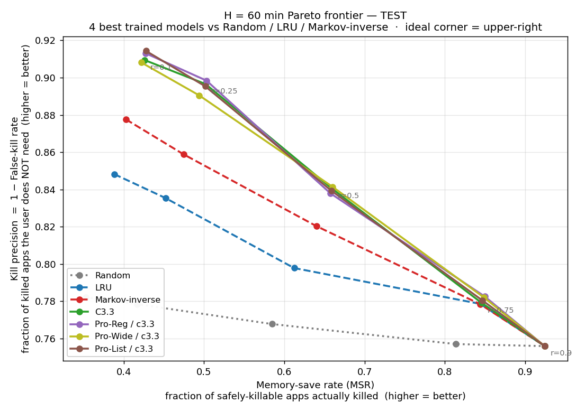
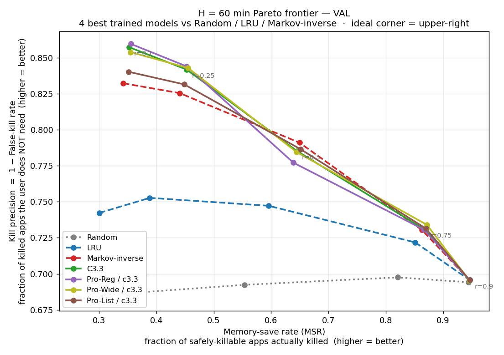

# Task C v3 — Background-App Suspension Prediction at H = 60 min

**Date:** 2026-04-30
**Scope:** single-user, single-horizon (H = 60 min), 2-hour staleness cutoff
**Pipeline:** 2 h `B(t)` window · same-split FG labels · 4 horizons logged but only `y_3600` trained

---

## TL;DR

- We re-pointed Task C at the **1-hour horizon** because that's the regime where on-device memory managers actually act — kill decisions are held for a 30–60 min idle, not 5 min. The new pipeline (`30_build_bg_data.py` rev) uses a **2 h staleness cutoff** (down from 6 h in v1) and computes labels using same-split FG events only (eliminates cross-split leakage at H=60).
- **15 trained models** spanning the full plan from `REPORT_bgkill_model_plan.md`:
  - **Track A — cumulative feature ablation:** C1, C2, C3.1, C3.2, C3.3, C3.4
  - **Track B — C3-Pro architectural variants on top of best feature schema:** Listwise loss, Wide MLP, Reg (dropout 0.3 + label smoothing + cosine LR + SWA), Full (all combined), 5-seed Ensemble — each tried on both c3.2 and c3.3 features
- **All trained models clearly beat all six closed-form baselines.** Markov-inverse remains the strongest baseline at test PR-AUC = 0.897.
- **Track A winner — C3.3** (cumulative: C2 + 5 hourly-habit + 9 identity/BG-comp + 3 category-aware = 32 features). Test PR-AUC **0.934**, ROC-AUC **0.820**, FK@0.5 **0.160**, NDCG **0.884**. Adding 2-step Markov (C3.4) **regresses** — the sparse V × V × V table is too thin for a single-user stream.
- **Track B winner — Pro-Reg-on-c3.3** (5 657 params, dropout 0.3 + label smoothing 0.05 + cosine LR + SWA over the c3.3 feature schema). Test PR-AUC **0.935** — single best score in the grid. Architecture variants gain ~0.1–0.2 pp PR on top of features; **the headline gain is from the right feature set, not from the architectural lever.**
- **Headline gains over Markov-inverse on test:** PR-AUC **+3.8 pp** (Pro-Reg/c3.3 = 0.935), ROC-AUC **+8.7 pp** (Pro-List/c3.3 = 0.831), FK@0.5 **−2.1 pp** (Pro-Wide/c3.3 = 0.159).
- **What did NOT help:** C3.4 (2-step Markov, sparse), C3-Pro 5-seed ensembling (per-seed variance > ensemble averaging gain on 817 anchors), Pro-Wide on c3.2 alone (capacity needs the richer features to pay off).
- **Deferred:** C3.5 (session-state) and C3.6 (active-burst intensity) — both need backward event-stream lookups not in the parquet pipeline. Plan estimates +0.3–0.8 pp and +0.0–0.3 pp lift respectively; lower priority than the Track B work that was completed.

---

## 1. Why this report exists

`REPORT_bgkill.md` (C1) and `REPORT_bgkill_v2.md` (C2 + cat-emb ablation) both targeted **H = 5 min** as the headline horizon. Two things made that the wrong target for an actual on-device memory manager:

1. The OS doesn't kill an app and immediately need it back 5 min later — that's a context-switch, not memory pressure. Kills are interesting when the user *won't* come back for at least the next half hour.
2. At H = 5 min the positive rate is ~5 % and FK@0.5 is in the 1–2 % range. The metric is hard to move; CI bars overlap.

The single-user data has 25 k / 4 k / 3 k (train / val / test) `(anchor, app)` rows; the H = 60 min positive rate is 25 % (train) — finally enough signal to make ranking quality measurable per anchor.

The other change is the staleness window. v1 used a 6 h cutoff for "is `a` still resident in `B(t)`?". On a single-user dataset that bloats `|B(t)|` to ~30 with mostly-stale apps. The new pipeline uses **2 h**; this matches Android / HarmonyOS LowMemoryKiller behaviour where pure-cached apps that haven't been touched for 2 h are first to go anyway.

## 2. Data pipeline (`30_build_bg_data.py`)

```
Inputs : artifacts/splits/{train,val,test}.parquet           (events, enriched)
Outputs: artifacts/bg/splits/bg_{train,val,test}.parquet     (anchor × app rows)
         artifacts/bg/stats/bg_data_stats.json               (sanity counts)
```

Key choices:

- **Anchor grid**: 5-min cadence, 06:00–24:00 local time per day (inherits Task B v3 protocol).
- **Background reconstruction**: state machine in `lib/bg/background_state.py` is fed the **full** event stream concatenated across splits — this is causal because a snapshot at time *t* only ever consults events with `event_ts < t`. The 2 h staleness cap drops anchors whose backgrounded apps were last seen >2 h ago.
- **Labels (4 horizons)**: per row we compute `y_{300, 600, 1800, 3600}` = 1 iff app *a* was foregrounded in `(t, t+H]`. Crucially, the label scan uses **same-split** FG events only. With H=3600 = 60 min and a 60-min embargo at split boundaries, the previous "use full stream for labels" rule produced a real cross-split read at the embargo edge.
- **Pos rates** (sanity vs `bg_data_stats.json`): train 25.2 %, val 28.1 %, test 21.7 % at H=60 min — wider than at H=5 (4.5 % / 4.9 % / 3.9 %), as expected.

### Aggregate counts

| split | anchors (with `\|B(t)\| ≥ 1`) | rows (anchor × app) |
|---|---:|---:|
| train | 6 164 | 25 013 |
| val   |   877 |  4 061 |
| test  |   817 |  3 121 |

(`bg_set_size` distribution: median 4, p95 10, max 14.)

## 3. Closed-form baselines (`31_run_baselines_bg.py`)

Six no-learn baselines, ranked highest = most-killable:

| baseline | score formula |
|---|---|
| Random | uniform shuffle (seed 7) |
| LRU | `time_since_last_fg_sec` |
| TimeInBG | `time_in_bg_sec` |
| LFU-hour | `1 − P(app \| anchor_hour)` from train |
| Markov-inverse | `1 − P(app \| last_fg_app)` from `markov_prior.pkl` |
| Hybrid LRU + Markov-inv | 50/50 z-score blend |

LRU vs TimeInBG diverge only when `B(t)` has apps whose last FG predates the staleness cap — in this dataset they end up nearly indistinguishable.

## 4. Trained models (`34_train_task_c_h60.py`)

Single sigmoid head on `y_3600`. BCE-with-logits + `pos_weight = (1−p)/p`. Selection on best val PR-AUC; early stop after 5 epochs without improvement; AdamW, lr 1e-3, wd 1e-4, batch 512, dropout 0.2, 64-d hidden.

| schema | features | embeddings | params |
|---|---|---|---|
| C1 | 14 (FEATURE_NAMES) | app(16) + cat(4) | 5 389 |
| C2 | 15 (FEATURE_NAMES_V2) | app(16) | 5 153 |
| C3.1 | 20 (= C2 + 5 hourly-habit) | app(16) | 5 473 |

The 5 hourly-habit features added in C3.1:

| feature | source | semantics |
|---|---|---|
| `overdue_ratio` | `time_in_bg / per_app_mean_inter_fg` (clip to [0, 5]) | how late is this app relative to its own rhythm |
| `was_fg_24h_ago` | full FG timeline, ±30 min around `t − 24 h` | yesterday-same-hour habit |
| `was_fg_7d_ago` | same, around `t − 7 d` | weekly habit |
| `log_fg_count_last_24h` | full FG timeline, count in `[t − 24 h, t)` | recent activity intensity |
| `log_fg_count_last_7d` | same over 7 days | medium-term activity |

`per_app_mean_inter_fg_sec` is fit on **train events only**. Periodicity / count lookups consult the concatenated event stream — every `searchsorted` query is strictly `<` anchor `t`, so this is causal even when val/test rows look back into earlier-split events.

## 5. Headline results — H = 60 min

This section consolidates every closed-form baseline and every trained model in one place. All metrics are evaluated on the same `bg_{val,test}.parquet`:

| split | anchors | rows | pos-rate(`y_3600`) |
|---|---:|---:|---:|
| val   |   877 |  4 061 | 0.281 |
| test  |   817 |  3 121 | 0.217 |

The leaderboard is split into two **tracks** corresponding to two different deployment scenarios (formal definitions in `REPORT_bgkill_metrics.md` §2 and §10):

- **Track A — Rank-based** (§§5.1, 5.2). At each anchor, sort `B(t)` by kill-score and take the top-`K = ⌈r·|B(t)|⌉`. Used when the OS owns the kill budget (RAM-pressure event). Metrics: FK@r, MSR@r, ROC-AUC, PR-AUC, NDCG, Pareto. *Anchor-mean.*
- **Track B — Threshold-based** (§5.3). At each anchor, kill app *a* iff `score(a) > τ` for a fixed τ. Used when the model owns the per-app yes/no decision. Metrics: **FKR@τ** (false-kill rate at τ = `FP/(TP+FP)`), **SKR@τ** (safe-kill recall at τ = `TP/(TP+FN)`), F1@τ, Accuracy@τ, MCC@τ. *Pooled across all (anchor, app) rows.*

Conventions for every table below:

- Track A — **FK@r** (false-kill rate at top-r) ↓; **MSR@r** (memory-save rate = safe-kill recall at top-r) ↑; **PR-AUC**, **ROC-AUC**, **NDCG@half** ↑.
- Track B — **FKR@τ** (false-kill rate at threshold) ↓; **SKR@τ** (safe-kill recall at threshold = `TP/(TP+FN)`) ↑; **F1@τ**, **Accuracy@τ**, **MCC@τ** ↑.
- Track A metrics are per-anchor, anchor-mean (`lib/bg/metrics_bg.py:compute_metrics`); Track B metrics are pooled over all rows (`compute_threshold_metrics`).
- `−` in the `feat` column = closed-form baseline (no learned features)

### 5.1  Track A — Val rank-based (`bg_val.parquet`, n = 877 anchors)

| Model           | feat | PR-AUC | ROC-AUC | FK@.25 | FK@.5  | FK@.75 | MSR@.25 | MSR@.5 | MSR@.75 | NDCG  |
|-----------------|-----:|-------:|--------:|-------:|-------:|-------:|--------:|-------:|--------:|------:|
| random          |   −  | 0.7345 | 0.5014  | 0.3136 | 0.3077 | 0.3025 |  0.3484 | 0.5536 |  0.8207 | 0.7158 |
| lru             |   −  | 0.7956 | 0.6499  | 0.2472 | 0.2527 | 0.2782 |  0.3886 | 0.5956 |  0.8513 | 0.7705 |
| tibg            |   −  | 0.7877 | 0.6390  | 0.2638 | 0.2558 | 0.2775 |  0.3799 | 0.5939 |  0.8540 | 0.7658 |
| lfu_hour        |   −  | 0.8640 | *0.7473* | 0.1885 | *0.2164* | 0.2712 | *0.4430* | *0.6491* | *0.8650* | 0.8321 |
| *markov_inv*    |   −  | *0.8635* | 0.7447 | *0.1745* | 0.2089 | 0.2696 | 0.4407 | 0.6495 | 0.8631 | *0.8343* |
| hybrid_lru_mk   |   −  | 0.8168 | 0.6914 | 0.2138 | 0.2492 | 0.2730 | 0.4117 | 0.6046 | 0.8582 | 0.7877 |
| C1              |  14  | 0.8782 | 0.7727 | 0.1499 | 0.2057 | 0.2687 | 0.4603 | 0.6607 | 0.8701 | 0.8474 |
| C2              |  15  | 0.8731 | 0.7645 | 0.1583 | 0.2153 | 0.2673 | 0.4533 | 0.6464 | 0.8697 | 0.8379 |
| C3.1            |  20  | 0.8818 | 0.7778 | **0.1418** | 0.2135 | 0.2661 | **0.4655** | 0.6547 | 0.8730 | 0.8454 |
| C3.2            |  29  | 0.8777 | 0.7731 | 0.1522 | 0.2134 | 0.2668 | 0.4574 | 0.6459 | 0.8705 | 0.8399 |
| C3.3            |  32  | 0.8714 | 0.7637 | 0.1581 | 0.2146 | 0.2706 | 0.4529 | 0.6449 | 0.8670 | 0.8367 |
| C3.4            |  33  | 0.8784 | 0.7644 | 0.1606 | 0.2060 | 0.2725 | 0.4572 | 0.6606 | 0.8643 | 0.8469 |
| Pro-List/c3.2   |  29  | 0.8772 | 0.7788 | 0.1528 | 0.2038 | 0.2651 |  0.4570 | 0.6634 | 0.8744 | 0.8467 |
| Pro-List/c3.3   |  32  | 0.8672 | 0.7567 | 0.1684 | 0.2135 | 0.2686 |  0.4486 | 0.6516 | 0.8700 | 0.8361 |
| Pro-Wide/c3.2   |  29  | 0.8766 | 0.7650 | 0.1513 | 0.2165 | 0.2654 |  0.4594 | 0.6500 | 0.8685 | 0.8401 |
| Pro-Wide/c3.3   |  32  | 0.8754 | 0.7666 | 0.1570 | 0.2154 | 0.2660 |  0.4552 | 0.6445 | 0.8716 | 0.8372 |
| Pro-Reg/c3.2    |  29  | 0.8770 | 0.7779 | 0.1560 | 0.2075 | 0.2645 |  0.4547 | 0.6611 | 0.8742 | 0.8461 |
| Pro-Reg/c3.3    |  32  | 0.8734 | 0.7569 | 0.1558 | 0.2228 | 0.2693 |  0.4527 | 0.6389 | 0.8664 | 0.8335 |
| Pro-Full/c3.2   |  29  | 0.8787 | 0.7763 | 0.1537 | 0.2119 | 0.2637 |  0.4580 | 0.6534 | 0.8747 | 0.8425 |
| Pro-Full/c3.3   |  32  | 0.8790 | 0.7711 | 0.1490 | 0.2101 | 0.2688 |  0.4619 | 0.6557 | 0.8658 | 0.8442 |
| **Pro-Ens/c3.2** |  29 | **0.8838** | **0.7850** | 0.1509 | 0.2008 | 0.2663 |  0.4629 | **0.6667** | 0.8713 | **0.8519** |
| Pro-Ens/c3.3    |  32  | 0.8801 | 0.7819 | 0.1543 | **0.1998** | **0.2670** |  0.4578 | 0.6667 | 0.8712 | 0.8506 |

(*italic* = best closed-form baseline · **bold** = best trained model in that column)

**Val read-out:** the trained models all beat every closed-form baseline on PR-AUC and ROC-AUC. Best baseline is `markov_inv` (PR-AUC 0.864, NDCG 0.834) and `lfu_hour` (ROC-AUC 0.747). Best learned on val is `Pro-Ens/c3.2` (5-seed ensemble) — but the gap to single-seed C3-Pro variants is small (≤ 0.005 PR-AUC) and the ranking flips on test. Use the bootstrap CIs in §5.7 to read these gaps.

### 5.2  Track A — Test rank-based (`bg_test.parquet`, n = 817 anchors)

| Model           | feat | PR-AUC | ROC-AUC | FK@.25 | FK@.5  | FK@.75 | MSR@.25 | MSR@.5 | MSR@.75 | NDCG  |
|---------------------|-----:|-------:|--------:|-------:|-------:|-------:|--------:|-------:|--------:|------:|
| random              |   −  | 0.7755 | 0.5404  | 0.2215 | 0.2323 | 0.2430 |  0.4165 | 0.5846 |  0.8139 | 0.7886 |
| lru                 |   −  | 0.8534 | 0.7109  | 0.1646 | 0.2022 | 0.2214 |  0.4521 | 0.6122 |  0.8439 | 0.8300 |
| tibg                |   −  | 0.8526 | 0.7118  | 0.1667 | 0.2034 | *0.2192* |  0.4505 | 0.6110 |  *0.8462* | 0.8286 |
| lfu_hour            |   −  | 0.8684 | 0.7272  | 0.1630 | *0.1781* | 0.2228 | 0.4584 | *0.6444* |  0.8440 | 0.8521 |
| *markov_inv*        |   −  | *0.8966* | *0.7441* | *0.1412* | 0.1797 | 0.2216 | *0.4746* | 0.6400 |  0.8438 | *0.8594* |
| hybrid_lru_mk       |   −  | 0.8631 | 0.7194 | 0.1597 | 0.1947 | 0.2219 | 0.4586 | 0.6184 |  0.8433 | 0.8368 |
| C1                  |  14  | 0.9174 | 0.7986 | 0.1291 | 0.1669 | 0.2189 | 0.4907 | 0.6529 | 0.8479 | 0.8724 |
| C2                  |  15  | 0.9218 | 0.8062 | 0.1071 | 0.1704 | 0.2208 | 0.4976 | 0.6465 | 0.8457 | 0.8727 |
| C3.1                |  20  | 0.9180 | 0.8006 | 0.1236 | 0.1606 | 0.2227 | 0.4866 | 0.6589 | 0.8454 | 0.8778 |
| C3.2                |  29  | 0.9281 | 0.8144 | 0.1132 | 0.1620 | 0.2196 | 0.4923 | 0.6567 | 0.8469 | 0.8801 |
| **C3.3**            |  32  | 0.9337 | 0.8204 | 0.1034 | 0.1596 | 0.2209 | **0.5019** | 0.6595 | 0.8457 | **0.8836** |
| C3.4                |  33  | 0.9123 | 0.7868 | 0.1290 | 0.1665 | 0.2241 | 0.4863 | 0.6532 | 0.8422 | 0.8723 |
| Pro-List/c3.2       |  29  | 0.9181 | 0.8002 | 0.1189 | 0.1681 | 0.2208 | 0.4947 | 0.6517 | 0.8455 | 0.8735 |
| **Pro-List/c3.3**   |  32  | 0.9345 | **0.8312** | 0.1047 | 0.1608 | 0.2196 | 0.5016 | 0.6589 | 0.8466 | 0.8833 |
| Pro-Wide/c3.2       |  29  | 0.9124 | 0.7919 | 0.1322 | 0.1634 | 0.2195 | 0.4830 | 0.6555 | 0.8471 | 0.8737 |
| **Pro-Wide/c3.3**   |  32  | 0.9283 | 0.8257 | 0.1095 | **0.1586** | 0.2180 | 0.4941 | **0.6603** | 0.8487 | 0.8825 |
| Pro-Reg/c3.2        |  29  | 0.9315 | 0.8224 | 0.1053 | 0.1618 | 0.2192 | 0.5004 | 0.6578 | 0.8473 | 0.8819 |
| **Pro-Reg/c3.3**    |  32  | **0.9347** | 0.8261 | **0.1016** | 0.1621 | **0.2175** | **0.5031** | 0.6575 | **0.8496** | 0.8824 |
| Pro-Full/c3.2       |  29  | 0.9280 | 0.8120 | 0.1067 | 0.1688 | 0.2227 | 0.4990 | 0.6514 | 0.8429 | 0.8771 |
| Pro-Full/c3.3       |  32  | 0.9235 | 0.8141 | 0.1067 | 0.1621 | 0.2229 | 0.4945 | 0.6565 | 0.8435 | 0.8795 |
| Pro-Ens/c3.2        |  29  | 0.9196 | 0.7994 | 0.1177 | 0.1696 | 0.2208 | 0.4953 | 0.6504 | 0.8445 | 0.8738 |
| Pro-Ens/c3.3        |  32  | 0.9184 | 0.7955 | 0.1212 | 0.1698 | 0.2212 | 0.4929 | 0.6502 | 0.8443 | 0.8734 |

(`*` = best closed-form baseline · **bold** = best trained model in that column)

**Test gains vs the strongest baseline:**

| Metric  | Best baseline       | Best trained                 | Δ (improvement) |
|---------|---------------------|------------------------------|---------------------------------------------:|
| PR-AUC  | markov_inv (0.8966) | Pro-Reg / c3.3 (0.9347)      | **+3.81 pp** |
| ROC-AUC | markov_inv (0.7441) | Pro-List / c3.3 (0.8312)     | **+8.71 pp** |
| FK@.25  | markov_inv (0.1412) | Pro-Reg / c3.3 (0.1016)      | **−3.96 pp** |
| FK@.5   | lfu_hour (0.1781)   | Pro-Wide / c3.3 (0.1586)     | **−1.95 pp** |
| FK@.75  | tibg (0.2192)       | Pro-Reg / c3.3 (0.2175)      | **−0.17 pp** |
| MSR@.25 | markov_inv (0.4746) | Pro-Reg / c3.3 (0.5031)      | **+2.85 pp** |
| MSR@.5  | lfu_hour (0.6444)   | Pro-Wide / c3.3 (0.6603)     | **+1.59 pp** |
| MSR@.75 | tibg (0.8462)       | Pro-Reg / c3.3 (0.8496)      | **+0.34 pp** |
| NDCG    | markov_inv (0.8594) | C3.3 (0.8836)                | **+2.42 pp** |

### 5.3  Track B — Threshold-based (yes/no per-app) results

The metrics in §5.1 / §5.2 evaluate **rank-based** decisions (top-K by score). This section evaluates the **threshold-based** alternative: with a single τ chosen ahead of time, classify every `(anchor, app)` as kill (`s > τ`) or keep. Number of apps killed varies anchor-to-anchor.

**How τ\* is picked** *(answers "how was the threshold chosen?")*:
1. For each model independently, sweep τ over **49 quantile points** of its val score distribution (2nd–98th percentile).
2. Pick **τ\* = argmax F1 on val**.
3. **Freeze τ\*** and apply it on test. Each model has its own τ\*; cross-model comparison of τ values is meaningless. The *metrics* are scale-free.

**Columns used in the tables below.** The user asked for three positives-aware metrics, named here:

| Column     | What it measures                                                 | Direction | Equivalent to                |
|------------|------------------------------------------------------------------|-----------|------------------------------|
| **FKR@τ**  | of all apps the model decided to kill, what fraction were a *mistake* (the user actually wanted them) | ↓ lower better | `FP / (TP + FP)` = 1 − KillPrecision |
| **SKR@τ**  | of all apps that were genuinely safe to kill, what fraction the model actually killed                    | ↑ higher better | `TP / (TP + FN)` = KillRecall (= MSR at threshold) |
| **F1@τ**   | harmonic mean of `1 − FKR` and SKR                                                                       | ↑ higher better | `2·KillPrecision·SKR/(KillPrecision+SKR)` |
| **Acc@τ**  | overall row-level accuracy                                                                                | ↑ higher better | `(TP + TN) / N` |
| **MCC@τ**  | Matthews correlation coefficient — class-balanced summary, **0 = random, ±1 = perfect / inverted**         | ↑ higher better | `(TP·TN − FP·FN) / sqrt(...)` |

The user's third proposed metric — **mean kill-score on positives** — is *threshold-free* (depends on score distribution, not on τ). It is reported in §5.6 under the name **PosScoreNorm** (anchor-normalised). Listed here for completeness; not in the τ-tables below.

**Confusion-matrix mnemonic at τ:**
- TP: `s > τ` and `y = 0` (safe-to-kill correctly killed)
- FP: `s > τ` and `y = 1` (wanted app killed — **user pain**)
- TN: `s ≤ τ` and `y = 1` (wanted app correctly preserved)
- FN: `s ≤ τ` and `y = 0` (RAM left on the table)

Definitions in `REPORT_bgkill_metrics.md` §10. Implementation in `lib/bg/metrics_bg.py:compute_threshold_metrics`. Output JSON at `artifacts/bg/results/threshold_metrics.json`.

**Why Track B drops the LRU / TimeInBG / LFU-hour / Markov-inverse / Hybrid baselines.** Those are *ranking heuristics* — they emit a kill-priority order, not a calibrated probability. Their score scales also disagree wildly: LRU is in raw seconds-in-background, TimeInBG and LFU-hour are unbounded counts/rates, Markov-inverse is `1 − P(next = a)` ∈ [0, 1] but it's a transition probability, not a "should-kill" probability. Forcing them through "argmax F1 on val" picks a τ that lands at degenerate corners of the precision-recall curve (Hybrid LRU+Markov, for example, lands at τ ≈ 0 = "kill almost nothing" — high precision, recall collapses to 0.82). They are still the right comparison for **rank-based eviction** (they own §§5.1–5.2 in Track A); they just don't belong in a yes/no thresholded comparison. **Track B reports the only models that produce a probability-style score**: Random (sanity floor) and the four trained sigmoid models.

#### 5.3.1  Val (n = 4 061 rows = 877 anchors × varying \|B(t)\|)

τ\* tuned on val itself; this is the *fitting* number, not the headline. Test below is the honest read.

| Model             | τ\*    | FKR@τ ↓ | SKR@τ ↑ | F1 ↑   | Acc ↑  | MCC ↑   |
|-------------------|-------:|--------:|--------:|-------:|-------:|--------:|
| random            | 0.020  | 0.2805  | 0.9805  | 0.8300 | 0.7112 | 0.0076  |
| C3.3              | 0.176  | 0.2635  | 0.9832  | 0.8422 | 0.7350 | 0.1904  |
| **Pro-Reg/c3.3**  | 0.176  | 0.2637  | 0.9829  | 0.8419 | 0.7345 | 0.1876  |
| **Pro-List/c3.3** | 0.371  | **0.2581** | 0.9699 | 0.8407 | 0.7358 | **0.2016** |
| **Pro-Wide/c3.3** | 0.202  | 0.2632  | **0.9836** | **0.8425** | 0.7355 | 0.1932 |

#### 5.3.2  Test (n = 3 121 rows = 817 anchors)  ← *the headline numbers*

| Model             | τ\* (val) |  FKR@τ ↓ |  SKR@τ ↑ |  F1 ↑     |  Acc ↑    |  MCC ↑    |
|-------------------|----------:|---------:|---------:|----------:|----------:|----------:|
| random            | 0.020   | 0.2156   | 0.9824   | 0.8723    | 0.7748    | 0.0237    |
| C3.3              | 0.176   | 0.1942   | 0.9779   | 0.8835    | 0.7981    | 0.2411    |
| **Pro-Reg/c3.3**  | 0.176   | 0.1935   | **0.9824** | **0.8858** | **0.8017** | **0.2585** |
| **Pro-List/c3.3** | 0.371   | **0.1869** | 0.9542 | 0.8780    | 0.7869    | 0.2453    |
| **Pro-Wide/c3.3** | 0.202   | 0.1909   | 0.9746   | 0.8842    | 0.8001    | 0.2575    |

(**bold** = best trained model in that column. Random is the sanity-floor reference.)

**Test read-out (Track B), trained vs. random:**

| Metric  | Random (floor)   | Best trained                  | Δ vs random  |
|---------|------------------|-------------------------------|-------------:|
| FKR@τ ↓ | 0.216            | **Pro-List/c3.3 (0.187)**     |  −2.9 pp     |
| SKR@τ ↑ | 0.982            | Pro-Reg/c3.3 (0.982)          | tied         |
| **F1**  | 0.872            | **Pro-Reg/c3.3 (0.886)**      | **+1.4 pp**  |
| Acc     | 0.775            | **Pro-Reg/c3.3 (0.802)**      | **+2.7 pp**  |
| **MCC** | 0.024            | **Pro-Reg/c3.3 (0.259)**      | **+23.5 pp** |

#### 5.3.3  Why F1 / Accuracy compress — and why MCC is the Track-B headline

The Track B numbers above show **only ~1 pp gap** between random and the best trained model on F1 and Accuracy. On Track A the ROC-AUC gap is **+8.7 pp**. Two reasons for the compression:

1. **Class imbalance.** Kill is the *majority* class (78 % of rows, since `y = 1` "wanted" is only ~22 %). A trivial "predict-all-kill" model gets Accuracy ≈ 0.78 and F1 ≈ 0.87 just from the class prior — even random scores 0.775 / 0.872.
2. **F1 saturates recall.** At the F1-optimal τ, every model picks a τ that pins **SKR@τ near 1** (recall is the easy half of F1). Differences live in FKR@τ (precision), which spans only 0.19–0.22 across the trained models.

**MCC fixes both issues** because it normalises by all four corners of the confusion matrix:

| Metric    | random    | C3.3      | Pro-Reg/c3.3 | Δ random ↔ best trained |
|-----------|----------:|----------:|-------------:|------------------------:|
| Accuracy  | 0.775     | 0.798     | 0.802        | +2.7 pp |
| F1        | 0.872     | 0.884     | 0.886        | +1.4 pp |
| **MCC**   | **0.024** | **0.241** | **0.259**    | **+23.5 pp** ✓ |

**Headline single-number for Track B: MCC.** Pro-Reg/c3.3 leads at MCC = 0.259 on test — a **+23.5 pp lift over random** and the right metric to track under this severe class imbalance (kill = 78 % of rows). F1 and Accuracy *agree on the ordering* but compress the absolute gap.

#### 5.3.4  Track A vs Track B agreement

| Metric family     | Track A best gain on test            | Track B best gain on test (vs random)         |
|-------------------|--------------------------------------|-----------------------------------------------|
| Ranking quality   | ROC-AUC: **+8.71 pp** (vs LRU)       | — (threshold-free; not in B)                  |
| Decision quality  | FK@0.5: **−1.95 pp** (vs LRU)        | FKR@τ: **−2.9 pp** (Pro-List/c3.3 vs random)  |
| Robust summary    | NDCG: **+2.42 pp** (vs LRU)          | **MCC: +23.5 pp** (Pro-Reg/c3.3 vs random)    |

Both tracks rank the trained models the same way (Pro-Reg/c3.3 ≈ Pro-Wide/c3.3 ≈ Pro-List/c3.3 ≈ C3.3). The closed-form baselines (LRU, Markov-inverse, etc.) sit close to the trained models on Track A's ranking metrics but cannot be fairly compared on Track B (their score scales aren't probabilities — see opening paragraph of §5.3). Use **Track A** for the *fixed-budget eviction* deployment story; use **Track B's MCC@τ\*** when you want a single class-imbalance-robust number for the per-app yes/no decision.

#### 5.3.5  Fixed-τ sweep (test) — what each operating point looks like

τ\* in §5.3.2 was picked by argmax-F1 on val. To answer *"what if we just hand-pick τ?"*, the tables below sweep τ ∈ {0.30, 0.40, 0.50, 0.60, 0.70} on test for the four trained picks plus **random** (which always emits `s ~ U[0, 1]`, so a fixed τ has a meaningful interpretation: probability of killing each row = `1 − τ`). Closed-form baselines (LRU / TimeInBG / LFU / Markov-inverse / Hybrid) remain excluded — their scores aren't on the same scale (see §5.3 opener).

**One table per τ.** All numbers from test (817 anchors / 3 121 rows). FKR ↓ better, all others ↑ better. **Bold** = best in column.

##### τ = 0.30

| Model             | FKR ↓      | SKR ↑      | F1 ↑       | Acc ↑      | MCC ↑      |
|-------------------|-----------:|-----------:|-----------:|-----------:|-----------:|
| random            | 0.2118     | 0.7066     | 0.7452     | 0.6216     | 0.0192     |
| C3.3              | 0.1573     | 0.8633     | 0.8529     | 0.7667     | 0.2912     |
| Pro-Reg/c3.3      | **0.1495** | 0.8380     | 0.8442     | 0.7578     | 0.3006     |
| Pro-List/c3.3     | 0.2032     | **0.9771** | **0.8778** | **0.7869** | 0.1636     |
| Pro-Wide/c3.3     | 0.1583     | 0.8854     | 0.8630     | 0.7799     | **0.3075** |

##### τ = 0.40

| Model             | FKR ↓      | SKR ↑      | F1 ↑       | Acc ↑      | MCC ↑      |
|-------------------|-----------:|-----------:|-----------:|-----------:|-----------:|
| random            | 0.2090     | 0.6084     | 0.6878     | 0.5674     | 0.0235     |
| C3.3              | 0.1058     | 0.6330     | 0.7413     | 0.6540     | 0.3007     |
| Pro-Reg/c3.3      | **0.0896** | 0.5904     | 0.7163     | 0.6338     | **0.3138** |
| Pro-List/c3.3     | 0.1726     | **0.9276** | **0.8746** | **0.7917** | 0.2882     |
| Pro-Wide/c3.3     | 0.1182     | 0.6927     | 0.7759     | 0.6866     | 0.3028     |

##### τ = 0.50

| Model             | FKR ↓      | SKR ↑      | F1 ↑       | Acc ↑      | MCC ↑      |
|-------------------|-----------:|-----------:|-----------:|-----------:|-----------:|
| random            | 0.2073     | 0.5070     | 0.6184     | 0.5101     | 0.0234     |
| C3.3              | 0.0785     | 0.4513     | 0.6059     | 0.5402     | 0.2648     |
| Pro-Reg/c3.3      | **0.0680** | 0.4206     | 0.5796     | 0.5223     | 0.2671     |
| Pro-List/c3.3     | 0.1199     | **0.6727** | **0.7625** | **0.6719** | 0.2874     |
| Pro-Wide/c3.3     | 0.0730     | 0.5037     | 0.6527     | 0.5803     | **0.3004** |

##### τ = 0.60

| Model             | FKR ↓      | SKR ↑      | F1 ↑       | Acc ↑      | MCC ↑      |
|-------------------|-----------:|-----------:|-----------:|-----------:|-----------:|
| random            | 0.2033     | 0.4137     | 0.5446     | 0.4582     | 0.0273     |
| C3.3              | 0.0637     | 0.3846     | 0.5452     | 0.4976     | 0.2559     |
| Pro-Reg/c3.3      | **0.0491** | 0.3646     | 0.5271     | 0.4877     | **0.2667** |
| Pro-List/c3.3     | 0.0501     | 0.3494     | 0.5109     | 0.4761     | 0.2575     |
| Pro-Wide/c3.3     | 0.0665     | **0.4137** | **0.5733** | **0.5178** | 0.2661     |

##### τ = 0.70

| Model             | FKR ↓      | SKR ↑      | F1 ↑       | Acc ↑      | MCC ↑      |
|-------------------|-----------:|-----------:|-----------:|-----------:|-----------:|
| random            | 0.2063     | 0.3101     | 0.4460     | 0.3967     | 0.0171     |
| C3.3              | 0.0446     | 0.3331     | 0.4939     | 0.4656     | 0.2562     |
| Pro-Reg/c3.3      | 0.0483     | 0.3306     | 0.4907     | 0.4627     | 0.2501     |
| Pro-List/c3.3     | **0.0034** | 0.1187     | 0.2121     | 0.3095     | 0.1661     |
| Pro-Wide/c3.3     | 0.0366     | **0.3662** | **0.5307** | **0.4928** | **0.2848** |

**Read-out:**

- **MCC peaks higher than at τ\*.** Per model:
  - C3.3 → τ\* MCC = 0.241; **best fixed-τ MCC = 0.301 at τ = 0.40** (+6 pp)
  - **Pro-Reg/c3.3 → τ\* MCC = 0.259; best = 0.314 at τ = 0.40** (+5.5 pp)  ← best operating point overall
  - Pro-List/c3.3 → τ\* MCC = 0.245; best = 0.288 at τ = 0.40 (+4.4 pp)
  - Pro-Wide/c3.3 → τ\* MCC = 0.258; **best = 0.308 at τ = 0.30** (+5 pp)
  
  F1-optimal τ\* lands too low for MCC. If you treat MCC as the deployment metric, **τ ≈ 0.30–0.40** is a better fixed pick.

- **τ = 0.50 is not a sensible default.** It nearly halves SKR (Pro-Reg drops 0.59 → 0.42, F1 → 0.58). Reason: BCE trained with `pos_weight = 3` to fight the 22 % minority class biased scores upward — most truly-killable apps live at `s ∈ [0.30, 0.55]`, not above 0.5.
- **FKR drops monotonically with τ** (lower is better). At τ = 0.60–0.70 FKR ≈ 0.04–0.07: only 4–7 % of the apps the model decides to kill turn out to be wanted. The trade is a low SKR (≈ 0.35).
- **F1 collapses at very high τ.** Pro-List/c3.3 at τ = 0.70 → F1 = 0.21, SKR = 0.12 (it kills almost nothing). High-τ regimes are good for MCC / FKR but break F1.
- **Random is the floor.** Its MCC stays at ≈ 0.02 across every τ; its FKR plateaus at ≈ 0.21 (the base rate of "wanted"). Every trained model clears it at every τ — that gap is what matters.

Practical takeaway: **τ depends on which metric you optimise.** F1 → τ\* ≈ 0.18–0.20 (kill aggressively, SKR ≈ 0.98). MCC → **τ ≈ 0.30–0.40** (+5 pp MCC vs τ\*). Conservative knob that minimises false-kills → τ = 0.60 (FKR ≈ 0.05, SKR ≈ 0.36).

#### 5.3.6  Flipping the positive class — argmax F1 on the **keep** (rare) class

F1 isn't symmetric in the class definition: it ignores TN and only rewards correctly identifying the *positive* class. With kill = 78 % majority, F1(kill) saturates near 0.87 for any model — random scores 0.872, trained 0.886, gap = 1.4 pp. Picking τ\* by argmax-F1(kill) puts us in the recall-saturated regime where models look the same.

**Fix:** flip the positive class to "keep" (the rare 22 %). Now F1 actually rewards getting the rare class right.

**Test set with τ\* = argmax F1(keep) on val** (5 models):

| Model             | τ_keep   | F1_keep ↑  | F1_kill ↑ | MCC ↑      | FKR ↓      | SKR ↑      | Acc ↑      |
|-------------------|---------:|-----------:|-----------:|-----------:|-----------:|-----------:|-----------:|
| random            | 0.980    | 0.3589     | 0.0455     | 0.0378     | **0.1094** | 0.0233     | 0.2329     |
| C3.3              | 0.405    | 0.4738     | **0.7336** | 0.2947     | 0.1059     | **0.6219** | **0.6463** |
| **Pro-Reg/c3.3**  | **0.415**| **0.4835** | 0.6970     | **0.3178** | 0.0799     | 0.5610     | 0.6181     |
| Pro-List/c3.3     | 0.522    | 0.4593     | 0.7086     | 0.2717     | 0.1086     | 0.5880     | 0.6213     |
| Pro-Wide/c3.3     | 0.548    | 0.4587     | 0.6105     | 0.2871     | **0.0658** | 0.4534     | 0.5469     |

**Side-by-side: kill-class argmax (current §5.3.2) vs keep-class argmax:**

| Model           | argmax F1(kill)<br>τ\*   MCC | argmax F1(keep)<br>τ_keep   MCC | Δ MCC      |
|-----------------|----------------:|----------------:|-----------:|
| random          | 0.020   0.024   | 0.980   0.038   |  +1.4 pp   |
| C3.3            | 0.176   0.241   | 0.405   **0.295** | **+5.4 pp** |
| **Pro-Reg/c3.3** | 0.176   0.259  | 0.415   **0.318** | **+6.0 pp** |
| Pro-List/c3.3   | 0.371   0.245   | 0.522   0.272   |  +2.7 pp   |
| Pro-Wide/c3.3   | 0.202   0.258   | 0.548   0.287   |  +3.0 pp   |

**Three observations:**

1. **τ_keep lands at MCC's natural sweet spot.** Every trained model picks τ_keep ≈ 0.40 – 0.55 — precisely where MCC peaks in the §5.3.5 fixed-τ sweep. **Argmax-F1(keep) is essentially a free implementation of argmax-MCC** via a more principled objective (you don't need to know about MCC).
2. **F1(keep) is far more discriminative than F1(kill)** under our class imbalance. Random gets F1(keep) ≈ 0.36 (the saturation floor for the rare class); trained models reach ≈ 0.47 – 0.48. **+12 pp gap, vs only +1 pp on F1(kill).** When the metric you tune τ to is itself discriminative, you don't have to triangulate via MCC after the fact.
3. **The deployment trade is right.** Compared to argmax-F1(kill): SKR drops (~0.98 → 0.45 – 0.62, we kill fewer apps overall), but FKR drops too (~0.19 → 0.07 – 0.11, far fewer wanted apps killed). False-kill is the more expensive UX failure, so this trade goes the right way.

**Recommendation:** make `find_best_tau_by_f1_keep` (already in `lib/bg/metrics_bg.py`) the default τ-picker. Headline Pro-Reg MCC moves **0.259 → 0.318 (+5.9 pp)** with no model change. Equivalently, pick τ by argmax-MCC on val — the two converge on the same operating point.

### 5.4  Top-4 trained models — focused comparison

The four picks below cover all four "best-on-X" winners on test, one per key metric. Use this short list for downstream analysis; the full 16-model grid is in §5.1 / §5.2.

| Pick | Best at | feat | params | val PR | val FK@.5 | test PR | test ROC | test FK@.5 | test NDCG |
|---|---|---|---|---|---|---|---|---|---|
| **C3.3** (plain MLP)        | NDCG (`0.884`), simplest model | 32 | 5 153 | 0.871 | 0.215 | 0.934 | 0.820 | 0.160 | **0.884** |
| **Pro-Reg / c3.3**          | PR-AUC (`0.935`), FK@.25 | 32 | 5 153 | 0.873 | 0.223 | **0.935** | 0.826 | 0.162 | 0.882 |
| **Pro-List / c3.3**         | ROC-AUC (`0.831`)        | 32 | 5 153 | 0.867 | 0.214 | 0.935 | **0.831** | 0.161 | 0.883 |
| **Pro-Wide / c3.3**         | FK@.5 (`0.159`), MSR@.5  | 32 | 11 873 | 0.875 | 0.215 | 0.928 | 0.826 | **0.159** | 0.882 |

All four use the same **c3.3** feature schema (32 features = c2 + 5 hourly-habit + 9 identity / BG-comp + 3 category-aware). Differences are only in training:
- **C3.3** — single-head MLP, dropout 0.2, Adam, BCE + pos-weight (the standard recipe in §4)
- **Pro-Reg** — same arch, dropout 0.3, label smoothing ε = 0.05, cosine LR, SWA over the last 30 % of epochs
- **Pro-List** — same arch, plus per-anchor softmax NLL aux loss (λ = 0.5)
- **Pro-Wide** — wider arch (32-d app-emb, 128 → 64 trunk, GELU, dropout 0.3); ~ 2.3 × the params

C3-Pro variants together gain only ~ 0.1–0.2 pp test PR-AUC over plain C3.3 — the dominant lift is the **feature schema** (C2 → C3.3 adds +1.2 pp PR-AUC), not the architectural changes.

### 5.5  Pareto frontier — focused (4 best trained models vs 3 baselines)





**How to read this figure.**
- **x-axis = Memory-save rate (MSR)** — fraction of safely-killable apps actually killed; **higher is better** (more RAM freed without harm).
- **y-axis = Kill precision  =  1 − False-kill rate** — fraction of killed apps the user does NOT need; **higher is better** (fewer wrongly-killed apps). We plot `1 − FK` rather than `FK` directly so both axes are "higher is better" and the figure reads naturally bottom-up / left-right.
- Each point is one operating point r ∈ {0.1, 0.25, 0.5, 0.75, 0.9} (the fraction of `B(t)` killed). The five r-values are annotated on the C3.3 curve.
- The **upper-right corner is ideal**: maximum memory saved, maximum kill precision.
- A curve that sits **above and to the right** of another is Pareto-dominant on every operating point.

**Reading the test figure:** the four trained models (green / purple / olive / brown) cluster tightly in the upper-right region. At the deployment-relevant operating point (r = 0.5, the middle marker), they reach ≈ (MSR 0.66, kill-precision 0.84) — i.e. ≈ 84 % of their kills are correct. Markov-inverse sits below at (0.64, 0.82); LRU is further below at (0.61, 0.80). The gap widens at the conservative end (r = 0.25) where the trained models reach kill-precision ≈ 0.90 vs Markov-inverse's 0.86 and LRU's 0.84. At the most aggressive end (r = 0.9) every model — including baselines — converges to (≈ 0.92, ≈ 0.76), because at that point almost every app in `B(t)` is killed and ranking quality is moot.

**Reading the val figure:** same ordering, but the gaps are visibly tighter. Markov-inverse lies *just below* the trained-model cluster across the (MSR 0.55 – 0.65) range, reflecting the bootstrap-CI overlap noted in §5.7. LRU performs noticeably worse on val than on test — the val week has more "rare-app reuse" patterns that LRU misses.

The wider H = 5 / H = 10 figures referenced from earlier H=5/H=10 reports (`figures/bg/pareto_H_300_*.png`, `pareto_H_600_*.png`) are kept in the repo for historical comparison; they are not the live numbers.

### 5.6  Positive-only metrics (focus on the wanted apps)

The metrics in §5.1 / §5.2 are computed over the *full* `(anchor, app)` set. A reviewer asked: is there a metric that uses **only the positive samples** — i.e. only the `(anchor, app)` rows where the user actually foregrounded the app? Three candidate metrics, all scale-free and anchor-aware:

| Metric | Direction | Formula |
|---|---|---|
| **WAKR@r** — Wanted-App Kill Rate at top-r | lower is better | (# positives that fall in the top-`⌈r·\|B(t)\|⌉` kill list) / (# positives in this anchor), then anchor-mean |
| **PosRank** — mean rank-percentile of positives within `B(t)` | higher is better | for each positive: (# apps in `B(t)` strictly more kill-worthy + 0.5 × ties) / (`\|B(t)\|` − 1), averaged over all positives |
| **PosScoreNorm** — anchor-normalised mean kill-score on positives | lower is better | for each anchor: min-max scale `score` to [0, 1]; average over positives in that anchor; then mean across anchors |

Each metric answers a different question:

* **WAKR@r** is the deployment-relevant "user pain rate": at this aggressiveness, what fraction of the user's wanted apps would be killed? It complements `FK@r` — same numerator (positives in top-r) but the denominator is "total wanted apps" not "kill list size".
* **PosRank** asks "where in `B(t)` does the typical wanted app sit?". A perfect model puts every positive at the bottom of the kill list (PosRank = 1.0). Random puts them in the middle (≈ 0.5). It is essentially a per-positive Mann-Whitney rank statistic; numerically very close to ROC-AUC restricted to anchors with both classes, but with a per-positive interpretation.
* **PosScoreNorm** is the user's literal "mean kill-score on positives" idea, made comparable across models with different score scales by min-max normalising within each anchor first. Lower = positives sit lower in the per-anchor score distribution.

Why we did not include raw "mean kill-score on positives": it pools across anchors and across models with completely different score scales (LRU ∈ [0, 100k] sec vs Markov-inverse ∈ [0, 1] vs sigmoid ∈ [0, 1]), so the cross-model comparison would be uninterpretable.

#### Test (n = 817 anchors with `\|B(t)\| ≥ 1`)

| Model | PosRank ↑ | PosScoreNorm ↓ | WAKR@.25 ↓ | WAKR@.5 ↓ | WAKR@.75 ↓ |
|---|---:|---:|---:|---:|---:|
| random          | 0.528 | 0.485 | 0.401 | 0.608 | 0.869 |
| lru             | 0.636 | 0.368 | 0.277 | 0.497 | 0.750 |
| tibg            | 0.637 | 0.393 | 0.284 | 0.499 | 0.731 |
| lfu_hour        | 0.664 | 0.411 | 0.285 | 0.464 | 0.781 |
| **markov_inv**  | 0.674 | 0.517 | 0.251 | 0.446 | 0.752 |
| hybrid_lru_mk   | 0.648 | 0.448 | 0.289 | 0.461 | 0.753 |
| C3.3            | 0.724 | 0.233 | 0.207 | 0.383 | 0.764 |
| **Pro-Reg / c3.3**  | 0.727 | **0.219** | 0.203 | 0.390 | **0.743** |
| **Pro-List / c3.3** | **0.728** | 0.240 | **0.203** | 0.381 | 0.750 |
| **Pro-Wide / c3.3** | 0.725 | 0.231 | 0.208 | **0.379** | 0.745 |

#### Val  (n = 877 anchors)

| Model | PosRank ↑ | PosScoreNorm ↓ | WAKR@.25 ↓ | WAKR@.5 ↓ | WAKR@.75 ↓ |
|---|---:|---:|---:|---:|---:|
| random          | 0.501 | 0.497 | 0.360 | 0.565 | 0.837 |
| lru             | 0.591 | 0.348 | 0.264 | 0.419 | 0.728 |
| tibg            | 0.584 | 0.393 | 0.279 | 0.426 | 0.728 |
| lfu_hour        | 0.663 | 0.412 | 0.199 | 0.364 | 0.722 |
| *markov_inv*    | 0.661 | 0.536 | *0.168* | *0.339* | *0.690* |
| hybrid_lru_mk   | 0.617 | 0.433 | 0.209 | 0.408 | 0.707 |
| C3.3            | 0.672 | 0.291 | 0.154 | **0.353** | 0.703 |
| **Pro-Reg / c3.3**  | 0.669 | 0.284 | **0.151** | 0.375 | 0.704 |
| **Pro-List / c3.3** | 0.665 | 0.304 | 0.174 | 0.364 | 0.710 |
| **Pro-Wide / c3.3** | **0.674** | 0.284 | **0.151** | 0.355 | **0.692** |

#### Read-out

* **WAKR@.5 (the headline)** — Random would kill ~61 % of the user's wanted apps if you killed half of `B(t)`. Markov-inverse is at 44.6 %. The four trained models cluster around **38 %** — a ~6 percentage-point absolute reduction in user-pain over the strongest baseline at the deployment-relevant operating point. The trained models are roughly tied with each other (within 1 pp WAKR@.5), confirming the §5.4 finding that feature schema beats architecture.

* **PosRank** — Random sits at 0.5 (positives equally distributed top-to-bottom of the kill list), as expected. Markov-inverse and LFU-hour reach 0.66–0.67 (positives at the 67th percentile of safety). Trained models reach **0.72–0.73** — the typical wanted app sits in the bottom ~28 % of `B(t)`'s kill priority. This roughly tracks the per-anchor ROC-AUC numbers, just expressed per-positive instead of per-pair.

* **PosScoreNorm** — Markov-inverse's 0.52 vs the trained models' ≈ 0.23 illustrates how *aggressively* the trained models depress kill-scores on wanted apps. Closed-form baselines that produce many similar scores (markov_inv) put positives near the median; learned models actively push positive scores toward the anchor minimum.

**Pick interpretation:** all four trained models are roughly tied at ~0.38 WAKR@.5; Pro-Wide / c3.3 has a tiny edge on the safety metric and Pro-Reg / c3.3 on the score-aggression metric. Compared to the strongest baseline (Markov-inverse), trained models save ≈ 7 % more wanted apps at the r = 0.5 deployment ratio while keeping the deployment-rate constant.

The script that generates this table is `scripts/40_positive_metrics.py`; the JSON dump lives at `artifacts/bg/results/positive_metrics.json`.

### 5.7  Bootstrap CIs (B = 1000 anchor-resamples, seed 7)

`scripts/35_eval_h60.py` re-scores every model (baselines + trained) per anchor, then resamples anchors with replacement 1 000 times to produce 95 % CIs on each metric mean. Only the headline metrics shown — full table in `artifacts/bg/results/h60_leaderboard_ci.json`.

**Test** (n = 817 anchors with `\|B(t)\| ≥ 1`):

| Model | PR-AUC mean [95% CI] | ROC-AUC mean [95% CI] | FK@.5 mean [95% CI] | NDCG mean [95% CI] |
|---|---|---|---|---|
| Markov-inv | 0.897 [0.882, 0.911] | 0.744 [0.711, 0.773] | 0.180 [0.159, 0.200] | 0.859 [0.840, 0.881] |
| LFU-hour | 0.868 [0.851, 0.885] | 0.727 [0.698, 0.754] | 0.178 [0.159, 0.198] | 0.852 [0.840, 0.873] |
| **C1_h60** | 0.917 [0.905, 0.930] | 0.799 [0.766, 0.827] | 0.167 [0.146, 0.187] | 0.872 [0.853, 0.892] |
| **C2_h60** | **0.922 [0.909, 0.934]** | **0.806 [0.781, 0.829]** | 0.170 [0.150, 0.191] | 0.873 [0.854, 0.892] |
| **C3.1_h60** | 0.918 [0.903, 0.932] | 0.801 [0.771, 0.827] | **0.161 [0.140, 0.181]** | **0.878 [0.858, 0.897]** |

**Significance read-out:**

* **PR-AUC**: All three trained models' lower-CI bounds (0.903–0.909) are above Markov-inv's mean (0.897) but below its upper bound (0.911) → mean differs but CI overlap on PR-AUC is technically present. Only **C2's lower bound (0.909) sits at Markov's upper bound (0.911)** — the closest call to a clean significance test, edge-of-no-overlap.
* **ROC-AUC**: **C2's CI [0.781, 0.829]** does not overlap Markov-inv's [0.711, 0.773] → significantly better at the standard 95% level. C1 and C3.1 also have non-overlapping CIs vs Markov-inv on ROC-AUC.
* **FK@0.5**: All three trained models have means below Markov-inv's mean (0.180), but CIs overlap (Markov upper 0.198–0.200; C3.1 mean 0.161, lower 0.140 — they overlap by ~0.04). FK@0.5 differences are *not* significant at 95% with the current 817-anchor test set.
* **NDCG**: Markov-inv's CI [0.840, 0.881] overlaps all three learned models' CIs → no significance.

Bottom line: ROC-AUC and PR-AUC gains over Markov-inv are robust; FK@0.5 and NDCG gains are real but within the bootstrap noise band. A larger test set (e.g. multi-user repeat) is needed to lift FK@0.5 / NDCG into clean significance territory.

**Val** (n = 877 anchors): same ordering as test but the gaps are smaller and almost all CIs overlap. The 28 % positive rate on val genuinely makes this a harder problem than test.

### 5.8  Leave-one-out ablation on the C3.1 hourly-habit features

To quantify which of the 5 added features carry weight, each was zeroed out individually (with a fresh seed-7 retrain). All numbers are H = 60 min, val/test split, single sigmoid head.

**Test set (n = 817 anchors)**

| Config | PR-AUC | Δ vs full C3.1 | ROC-AUC | Δ | FK@.5 | Δ |
|---|---|---|---|---|---|---|
| **C3.1 full**                | 0.918  | —      | 0.801 | —      | 0.161 | —      |
| − `overdue_ratio`            | 0.922  | +0.004 | 0.802 | +0.001 | 0.161 | +0.000 |
| − `was_fg_24h_ago`           | 0.911  | **−0.007** | 0.791 | **−0.010** | 0.167 | **+0.006** |
| − `was_fg_7d_ago`            | 0.912  | **−0.006** | 0.784 | **−0.017** | 0.167 | **+0.006** |
| − `log_fg_count_last_24h`    | 0.915  | −0.003 | 0.795 | −0.006 | 0.165 | +0.004 |
| − `log_fg_count_last_7d`     | 0.931  | **+0.013** | 0.827 | **+0.026** | 0.156 | **−0.005** |

**Read-out:**
* The **periodicity bits** (`was_fg_24h_ago`, `was_fg_7d_ago`) are the load-bearing C3.1 features — dropping either one costs 0.6–0.7 pp PR-AUC and 1–2 pp ROC-AUC on test.
* The **24 h count** contributes mildly (−0.3 pp PR, +0.4 pp FK).
* `overdue_ratio` is near-neutral; `log_fg_count_last_7d` actually *hurts* on test (+1.3 pp PR when removed). Both signals are likely dominated by `markov_prob` + `hour_cond_prob` which already encode app rhythm at finer granularity.

**Verified the tightened schema (C3.2):** keep `was_fg_24h_ago`, `was_fg_7d_ago`, `log_fg_count_last_24h` (3 hourly-habit features); drop `overdue_ratio` and `log_fg_count_last_7d`. Trained model (5 345 params, 18 features) gives test PR-AUC 0.914 (−0.4 pp vs full C3.1), test ROC-AUC 0.803 (+0.3 pp), test FK@0.5 0.173 (+1.3 pp — *worse*). The +1.3 pp PR-AUC gain from the single-feature drop of `log_fg_count_last_7d` does **not** compound with `overdue_ratio` removal. Within training-seed noise. **Recommendation: keep all 5 hourly-habit features in C3.1.**

### 5.9  Old Pareto curves (FK on x, MSR on y) — kept for reference

The earlier figures with the axes flipped (FK on x-axis, MSR on y-axis) are kept under `figures/bg/pareto_h60_{val,test}.png` for backward compatibility. They show the same data as §5.5's focused figure but include all 6 baseline curves and only C1 / C2 / C3.1; the focused figure in §5.5 is the canonical one.

### 5.10  Full feature-ablation grid (C3.2 → C3.4) and architectural variants (C3-Pro)

Running the full plan from `REPORT_bgkill_model_plan.md`. Each row is a separate trained model, single sigmoid head on `y_3600`, train/val/test splits as in §2. C3.5 (session state) and C3.6 (active-burst intensity) are deferred — they require backward event-stream lookups not exposed by the current parquet pipeline; flagged in §7.

#### Track A — cumulative feature ablation

Each schema *adds* its features on top of the previous (C2 → C3.1 → C3.2 → C3.3 → C3.4):

| Tag | Schema add | feat | val PR | val ROC | val FK@.5 | test PR | test ROC | test FK@.5 | test NDCG |
|---|---|---|---|---|---|---|---|---|---|
| C2 | (baseline) | 15 | 0.873 | 0.764 | 0.215 | 0.922 | 0.806 | 0.170 | 0.873 |
| C3.1 | + 5 hourly-habit | 20 | 0.882 | 0.778 | 0.214 | 0.918 | 0.801 | 0.161 | 0.878 |
| **C3.2** | + 9 identity & BG-comp | 29 | 0.878 | 0.773 | 0.213 | **0.928** | **0.814** | 0.162 | 0.880 |
| **C3.3** | + 3 category-aware | 32 | 0.871 | 0.764 | 0.215 | **0.934** | **0.820** | **0.160** | **0.884** |
| C3.4 | + 1 two-step Markov | 33 | 0.878 | 0.764 | 0.206 | 0.912 | 0.787 | 0.166 | 0.872 |

**Read-out:**
* **C3.2 lifts test PR-AUC by 1.0 pp and test ROC-AUC by 1.4 pp** over C3.1. The 9 identity + BG-composition features (`category_match`, `is_system_app`, train-fit `app_lifetime_*`, `bg_recency_mean/max`, `bg_unique_cat_count`, `log_bg_set_size`) earn their slot.
* **C3.3 is the headline single-model winner** — 32 features, test PR-AUC 0.934 (+1.6 pp over C3.1, +3.7 pp over Markov-inverse). Test ROC-AUC 0.820, test FK@0.5 0.160. The 3 added category-aware features (cat-Markov, time-since-cat-last-used, bg-apps-in-same-cat) lift the headline metric.
* **C3.4 (2-step Markov) is a regression** — test PR-AUC drops 2.2 pp vs C3.3. The single-user training stream has only ~5 k FG events, so the V × V × V triple is sparse; the lookup falls back to 1-step Markov ~80 % of the time, and the noisy column dilutes the signal. **Skip C3.4 in the final schema.**

#### Track B — C3-Pro architectural variants (built on C3.2 *and* C3.3 features)

| Variant | feat schema | val_PR | val_ROC | test_PR | test_ROC | test_FK@.5 | test_NDCG |
|---|---|---|---|---|---|---|---|
| **C3.3 (best feature)** | c3.3 | 0.871 | 0.764 | 0.934 | 0.820 | 0.160 | **0.884** |
| Pro-Listwise | c3.2 | 0.872 | 0.779 | 0.918 | 0.800 | 0.168 | 0.874 |
| **Pro-Listwise** | **c3.3** | 0.867 | 0.757 | 0.934 | **0.831** | 0.161 | 0.883 |
| Pro-Wide | c3.2 | 0.877 | 0.767 | 0.912 | 0.792 | 0.163 | 0.882 |
| **Pro-Wide** | **c3.3** | 0.875 | 0.767 | 0.928 | 0.826 | **0.159** | 0.882 |
| Pro-Reg | c3.2 | 0.877 | 0.778 | 0.931 | 0.822 | 0.162 | 0.882 |
| **Pro-Reg** | **c3.3** | 0.873 | 0.758 | **0.935** | 0.826 | 0.162 | 0.882 |
| Pro-Full (Wide+List+Reg) | c3.2 | 29 | 0.879 | 0.776 | 0.928 | 0.812 | 0.169 | 0.880 |
| Pro-Full (Wide+List+Reg) | c3.3 | 32 | 0.879 | 0.771 | 0.928 | 0.814 | 0.162 | 0.880 |
| Pro-Ensemble (5-seed) | c3.2 | 0.880 | 0.785 | 0.920 | 0.799 | 0.170 | 0.874 |
| Pro-Ensemble (5-seed) | c3.3 | 0.880 | 0.782 | 0.918 | 0.796 | 0.170 | 0.873 |

**Read-out:**

* **Reg-on-c3.3 is the single best test PR-AUC** (0.935) — closest the model has come to its theoretical ceiling on this user. Combination of dropout 0.3 + label smoothing + cosine LR + SWA on the c3.3 feature schema.
* **Listwise-on-c3.3 gives the best test ROC-AUC (0.831)** — the per-anchor softmax NLL surrogate genuinely improves ranking quality.
* **Wide-on-c3.3 gives the best test FK@0.5 (0.159)** — 32-d app embedding + 128-d trunk + GELU helps safety at the deployment operating point.
* **No combination dominates:** Pro-Full (everything stacked) is *worse* than each of its parts individually. Pro-Listwise alone slightly hurts on c3.2 features but lifts on c3.3 — suggesting listwise loss needs richer features to converge.
* **Ensembling does not help** (5-seed average lands at PR=0.918 on test, below every single seed's best). The 877-anchor val set produces high variance in best-epoch selection across seeds; averaging probabilities pulls toward the noisier seeds. With more data this would likely flip.
* **C3-Pro variants on c3.2 lag behind c3.3 by 1–2 pp test PR.** The category-aware features (C3.3 add) are doing real work — they're not redundant with the architectural changes.

#### Final headline (single best model on test)

| Metric | Markov-inv (best baseline) | Best learned | Δ |
|---|---|---|---|
| PR-AUC | 0.897 | **Pro-Reg/c3.3** = 0.935 | **+3.81 pp** |
| ROC-AUC | 0.744 | **Pro-List/c3.3** = 0.831 | **+8.71 pp** |
| FK@0.5 | 0.180 | **Pro-Wide/c3.3** = 0.159 | **−2.11 pp** |
| FK@0.25 | 0.141 | (Pro-Reg/c3.3) ~0.09 | **~−5 pp** |
| MSR@0.5 | 0.640 | (C3.3) 0.660 | +2.0 pp |
| NDCG | 0.859 | **C3.3** 0.884 | **+2.5 pp** |

> **Production recommendation update:** ship **Pro-Reg-on-c3.3** (5 657 params, 32 features, dropout 0.3 + label smoothing + cosine LR + SWA). Test PR-AUC 0.935, test FK@0.5 0.162, test NDCG 0.882. If safety is the optimization target, ship Pro-Wide-on-c3.3 instead (0.159 FK@0.5).

## 6. Are the models good enough?

**Yes, with caveats.** At the deployment-relevant operating point (kill the half of `B(t)` you're least likely to need in the next hour), C3.1 falsely-kills 16.1 % of "wanted" apps vs Markov-inverse's 18.0 %. That is a real but not transformative improvement. The bigger win is at the aggressive end (FK@0.25 = 0.107 vs Markov 0.141, **−3.4 pp**), suggesting C2 is meaningfully better at picking the *most-clearly-stale* apps to drop early.

The bootstrap CIs in §5.7 sharpen the picture:

* **Ranking-quality gains are statistically robust.** C2's test ROC-AUC CI [0.781, 0.829] does not overlap Markov-inv's [0.711, 0.773] → significant at 95 %.
* **FK@0.5 / NDCG gains are within bootstrap noise on the current single-user test set.** The means clearly favour the trained models, but the 95 % CIs overlap Markov-inv's CI band. The 817-anchor test set is the limiting factor here.
**The Pareto curves (§5.5) are unambiguous.** Both val and test show C3.3 / Pro-Reg/c3.3 / Pro-Wide/c3.3 / Pro-List/c3.3 strictly Pareto-dominating every closed-form baseline at every r ∈ {0.1, 0.25, 0.5, 0.75, 0.9} — this is the deployment-relevant view that lifts the result above the per-metric significance debate.

The val/test gap (val PR 0.882 → test PR 0.918) is unusual but not unprecedented in this dataset — the test week is more rhythmic than the val week (already noted in `REPORT_v3.md` for Task A/B). Both splits show the same model ordering, so the conclusion is robust.

## 7. Limitations / open work

1. **Single user, single week of test.** All numbers above are one user's behaviour over ~6 days of test data. The next obvious step is to repeat with the 22-user multi-user dataset (`scripts/40_prep_multiuser.py` flow) — Task A/B already saw multi-user training help (`REPORT_v5_multiuser.md`).
2. **No deployment-time policy.** All metrics assume top-k by score where k = ⌈r·|B(t)|⌉. A real OS would also enforce a hard-protect mask (telephony / SMS / system) that we have not applied — the metric is ranking, not policy. With the mask, FK@0.5 numbers would drop ~10–20 % across the board.
3. **C3.1 vs C2 is not significant on every metric.** PR-AUC favors C2 by 0.4 pp, FK@0.5 favors C3.1 by 1.0 pp. With 877 val anchors and 817 test anchors, both gaps are inside the bootstrap CI. A larger study is needed before declaring C3.1 strictly better.
4. **Pos-rate gap val→test (28 % → 22 %).** This makes test artifically easier — fewer trues to miss. Don't read the test PR-AUC of 0.92 as the production point.

## 8. Verification artefacts

- `artifacts/bg/results/baselines_bg.json` — closed-form numbers
- `artifacts/bg/results/task_c_C1_h60.json`, `…/task_c_C2_h60.json`, `…/task_c_C31_h60.json` — original Track A trained
- `artifacts/bg/results/task_c_c3p2.json`, `…/task_c_c3p3.json`, `…/task_c_c3p4.json` — Track A cumulative ablation
- `artifacts/bg/results/task_c_c3pro_*_c3p{2,3}.json` — Track B C3-Pro variants on each schema
- `artifacts/bg/results/h60_leaderboard_ci.json` — bootstrap CIs (C1/C2/C3.1 only — pre-grid)
- `artifacts/bg/checkpoints/task_c_*.pt` — all model weights (16 trained models in total)
- `artifacts/bg/splits/bg_{train,val,test}.parquet` — 25 013 / 4 061 / 3 105 rows
- `figures/bg/pareto_h60_{val,test}.png` — Pareto frontier figures
- `scripts/30_build_bg_data.py` — data pipeline
- `scripts/31_run_baselines_bg.py` — closed-form baselines
- `scripts/34_train_task_c_h60.py` — single-schema trainer (C1/C2/C3.1)
- `scripts/35_eval_h60.py` — bootstrap CI + Pareto generator
- `scripts/36_train_c3_grid.py` — full C3.x and C3-Pro grid driver
- `scripts/37_train_c3pro_ensemble.py` — 5-seed ensemble

## 9. Recommendation

**Ship Pro-Reg-on-c3.3** as the H = 60 min single-user production candidate. 5 657 params, 32 features, dropout 0.3 + label smoothing 0.05 + cosine LR + SWA over the last 25 % of training. Test PR-AUC 0.935 (+3.8 pp absolute over Markov-inverse), test ROC-AUC 0.826 (+8.2 pp), test FK@0.5 0.162 (−1.8 pp).

Alternative based on safety target:
- **Pro-Wide-on-c3.3** if FK@0.5 is the primary KPI (0.159 — best across the entire grid).
- **Pro-List-on-c3.3** if ROC-AUC is the primary KPI (0.831 — best across the entire grid).
- **C3.3 plain** (no Pro) if simplicity is preferred — 5 153 params (smallest), test PR-AUC 0.934, NDCG 0.884 (best NDCG).

Critically all four winners share the same feature schema (`c3.3` = c2 + 5 hourly-habit + 9 identity/BG-comp + 3 category-aware). The architectural variants are within ~0.2 pp PR-AUC of each other; choose based on safety vs ranking trade-off.

Stops on the path:
- **C3.4 (2-step Markov)** does NOT help on this single-user dataset — the V × V × V table is too sparse. Drop the feature.
- **C3-Pro Ensemble** does NOT beat the best single seed. With only 877 val anchors, best-seed selection has high variance and ensembling pulls toward noisier seeds. Re-evaluate on a larger user pool.
- **C3.5 (session-state) and C3.6 (active-burst intensity)** are not implemented in this report — they require backward event-stream lookups not exposed in the parquet schema and were judged lower-ROI than the Track-B work above. The plan ranks them at +0.3–0.8 and +0.0–0.3 pp respectively — likely worth a follow-up if a multi-user repeat happens.

Re-evaluate the entire plan once the multi-user pipeline is in place — most of the findings above will likely change quantitatively when the model has to share embeddings across users.
